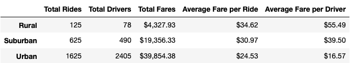
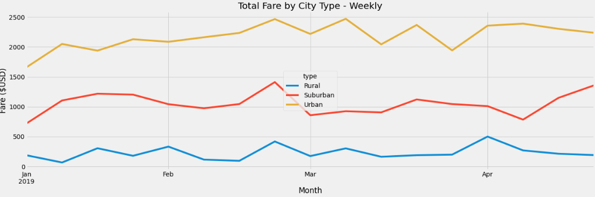

# PyBer_Analysis

## <u>Project Overview</u>
The project consisted in inspecting Ride-Sharing data in order to create visualizations and reports for PyBer. Data was analyzed by merging large data sets, performing statistical calculations on data frames, and creating line chart to discover trends. 

## <u>Results</u>
Summary by city type:

From the table, we can see that urban cities had the highest number of rides compared to rural and suburban cities. On the other hand, rural cities, m had the lowest number of rides. For the drivers category, urban cities had the most number of drivers.

Line chart showing total fare by city type:

The time frame for this data is January 1ts, 2019 to April 29th, 2019

This Line chart shows the fares for each week. We can see that the last week of February the highest fares for Urban and Suburban city types. For Rural cities, the highest fare was during last week of April.

## <u>Summary</u>
-   It would be a good idea to have incentives for drivers to work in other cities, so that drivers from urban cities can work on rural and suburban areas.
-   The date range was short; it is challenging to make decisions baes only on the first 4 moths of the year. The time/date range should be increased in order to have a better understanding at analyzing the data and making better and accurate decisions. 
-   Lastly, it would be interesting to consider more categories to add to our data. For example, economic background popular places, age, etc. in order to have a better understanding of population trends and launch marketing campaigns for specific groups.

## <u>Resources</u>

[barh](https://matplotlib.org/stable/gallery/lines_bars_and_markers/barh.html#sphx-glr-gallery-lines-bars-and-markers-barh-py)

[pyplot.plot](https://matplotlib.org/stable/api/_as_gen/matplotlib.pyplot.plot.html)

[object-oriented](https://matplotlib.org/stable/tutorials/introductory/usage.html)

[matplotlib.marlers](https://matplotlib.org/3.1.1/api/markers_api.html?highlight=marker#module-matplotlib.marlers)

[rotate x-axis tick labels](https://stackoverflow.com/questions/32244019/how-to-rotate-x-axis-tick-labels-in-pandas-barplot)